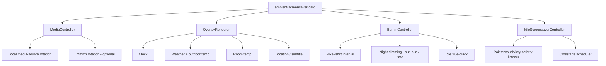

# Custom Home Assistant Card — "Ambient Screensaver" — Implementation Plan

> **Supersedes:** [ambient-screensaver-plan.md](ambient-screensaver-plan.md) and [ambient-screensaver.yaml](ambient-screensaver.yaml) (WallPanel + button-card approach). Kept for reference, but abandoned due to config-key mismatches, WallPanel's coarse-grained info-box model, and Immich CORS friction. This plan builds a **bespoke Lovelace custom card** instead — full control, no third-party glue.

---

## 1. Objective

Same visual/functional target as before — a Google Nest Hub–style ambient screen with full-bleed rotating photos, a bottom-left clock/weather/room-temp stack, and a bottom-right location/subtitle stack, with burn-in protection and smooth crossfades — but implemented as **one purpose-built Lovelace custom card** (`custom:ambient-screensaver-card`) instead of composing WallPanel + button-card.

---

## 2. Why pivot (lessons from the WallPanel attempt)

| Problem hit | Root cause | How a custom card avoids it |
|---|---|---|
| "Custom element doesn't exist: wallpanel" | WallPanel is a dashboard-level `wallpanel:` key, not a card — easy to misconfigure | We register one real custom element; standard, well-understood Lovelace resource flow |
| "Expected an array value... views" | Composing two unrelated systems (dashboard raw config + card config) made the required top-level shape easy to get wrong | A card is just one entry in a normal `views: [...] cards: [...]` list — no special top-level keys |
| Config key mismatches (`image_fit` vs `image_fit_landscape`, `image_order` vs `media_order`, etc.) | Guessed at WallPanel's large, versioned config surface without the docs in front of us | We define our **own** config schema — no guessing, no upstream API drift |
| Immich CORS requirement (reverse proxy needed) | WallPanel's Immich support calls the Immich API directly from the browser | Our card fetches media through **HA's own authenticated WebSocket API** (`media_source`), so the browser never talks to Immich directly — no CORS at all |
| button-card JS-template gymnastics for burn-in/dimming | Squeezing real logic into `[[[ ]]]` template strings inside YAML | Plain TypeScript in the card — real functions, real state, real testability |

---

## 3. Tech stack & repo structure

- **Language:** TypeScript
- **Framework:** LitElement (the standard base class for HA custom cards — same one HA's own built-in cards use)
- **Bundler:** Rollup (HACS/HA-ecosystem convention; produces a single ES module file)
- **Package manager:** npm

Repo layout:
```
ha-ambient-screensaver-card/
├─ hacs.json                     # HACS metadata (name, render_readme, etc.)
├─ package.json
├─ tsconfig.json
├─ rollup.config.js
├─ README.md
├─ src/
│  ├─ ambient-screensaver-card.ts     # main LitElement custom element
│  ├─ editor.ts                       # visual config editor (GUI, required for v1)
│  ├─ media/
│  │  ├─ media-source.ts              # local folder rotation via hass.callWS
│  │  └─ immich.ts                    # Immich album rotation via hass.callWS (media_source)
│  ├─ overlay/
│  │  ├─ clock.ts                     # 12h clock, ticking
│  │  ├─ weather.ts                   # condition → icon, temp fallback logic
│  │  ├─ room-temp.ts                 # entity → climate-attr → literal fallback logic
│  │  └─ location.ts                  # static or Immich-metadata-driven text
│  ├─ burn-in/
│  │  ├─ pixel-shift.ts               # small periodic overlay translate()
│  │  ├─ night-dimming.ts             # sun.sun / time-window driven opacity
│  │  └─ idle-black.ts                # idle timer → fade to black
│  ├─ styles.ts                       # shared CSS (shadow DOM, no HA chrome)
│  └─ types.ts                        # config schema types
└─ dist/
   └─ ambient-screensaver-card.js     # rollup output — this is the Lovelace resource
```

---

## 4. Card architecture

**One custom element:** `<ambient-screensaver-card>` (Lovelace type `custom:ambient-screensaver-card`), used as a normal card inside any dashboard view — ideally a **panel view** for full-bleed. It implements the standard HA card lifecycle: `setConfig()`, the `hass` setter, `getCardSize()`, and **`getConfigElement()`** (returns the visual editor described in §13 — required for v1, not optional).

Internal composition (all inside the element's own Shadow DOM — total style isolation, no `card-mod` or DOMPurify concerns):



**Responsibilities:**
- `MediaController` — owns the current/next image, preloads the next image before crossfade, exposes `displayTime`/`crossfadeTime` as config.
- `OverlayRenderer` — pure render logic for the four text regions; receives resolved values (already fallback-guarded) as plain strings/numbers, no templating language needed.
- `BurnInController` — a single `setInterval`-driven small CSS `transform: translate()` nudge (few px), a `hass.states['sun.sun']` (or time-window) subscription for opacity, and an idle timer for true-black.
- `IdleScreensaverController` — **fully self-contained**, replacing WallPanel's idle engine: listens for `pointermove`/`pointerdown`/`touchstart`/`keydown` on `window`, tracks `idleTime`, and toggles a "dimmed/active" state class. (Card is designed to live on its own dedicated view/dashboard, so "idle" here just governs burn-in dimming, not navigation.)

---

## 5. Config schema (card-level, no dashboard-level keys)

All previous "CONFIG" knobs move to being **card config properties** (this is prose/schema description, not implementation code):

| Group | Keys (indicative) |
|---|---|
| Media source | `media_mode` (`local` \| `immich`), `local_media_path`, `image_fit`, `immich_access_mode` (`media_source` \| `api`), `immich_album_id` (media-source mode), `immich_url`, `immich_api_key`, `immich_image_size` (`thumbnail` \| `preview` \| `fullsize`), `immich_profiles` (list — see §6) (api mode) |
| Timing | `display_time`, `crossfade_time` |
| Clock | (no config — always 12h, no leading zero) |
| Outdoor weather | `weather_entity`, `outdoor_temp_entity` + `_fallback_entity` + `_default`, `outdoor_high_entity` + `_fallback_entity` + `_default` |
| Room temp | `room_temp_entity`, `room_temp_climate_entity`, `room_temp_default`, `room_label`, `room_unit` |
| Location/subtitle | `location_text` / `location_source` (`static` \| `immich_metadata`), `subtitle_text` |
| Typography | `clock_font_size`, `weather_font_size`, `room_font_size`, `location_font_size`, `subtitle_font_size` (all accept CSS `clamp()` strings) |
| Styling | `text_shadow` |
| Burn-in | `pixel_shift_distance`, `pixel_shift_period`, `night_dim_mode` (`sun` \| `hours`), `night_dim_start_hour`, `night_dim_end_hour`, `day_opacity`, `night_opacity`, `idle_black_after` |
| Interaction | `idle_time` (governs burn-in only, per §4) |

A JSON Schema / TS `interface AmbientScreensaverCardConfig` in `types.ts` is the single source of truth; validated at `setConfig()` time with clear thrown errors (visible in the card's own error state, not a cryptic Lovelace-level error).

---

## 6. Media sources

- **Local folder:** call `hass.callWS({ type: 'media_source/browse_media', media_content_id: 'media-source://media_source/local/<folder>' })` to list files, then `media_source/resolve_media` to get a playable URL. This is the same authenticated path HA's own media browser uses — always same-origin, no CORS concern.
- **Immich — media-source mode (`immich_access_mode: media_source`, no CORS problem):** if the user has the official Immich HA integration exposing Immich as a `media_source` provider, use the identical `media_source/browse_media` / `resolve_media` calls — still same-origin, still authenticated by the existing HA session.
- **Immich — direct API mode (`immich_access_mode: api`):** added per the user's explicit requirement for full profile-based control (random pool, album, people/faces, favorites, "on this day" memories, location/trips — see the endpoint table the user supplied). The card calls Immich's REST API directly from the browser via `fetch()`:
  - `POST /search/random` (with `albumIds`/`personIds`/`isFavorite`/`city`/`state`/`country`/`size`/`type: "IMAGE"` as applicable) for every filter type except memories.
  - `GET /memories?type=ON_THIS_DAY` for the memories profile type.
  - Each **profile** is one filter combination; all enabled profiles' asset ids are merged (deduped) into one shared random pool, matching the user's "combination of options... feed into the overall random pool" requirement.
  - `GET /assets/{id}/thumbnail?size=...` (or `/assets/{id}/original` for `fullsize`) fetched as an authenticated blob and displayed via `URL.createObjectURL()` (a plain `background-image: url()` can't carry the `x-api-key` header, so the image bytes must be fetched via `fetch()` first). Blob URLs are revoked once a photo is no longer displayed, to avoid a slow memory leak over the screensaver's very long uptime.
  - `GET /assets/{id}` for `exifInfo.dateTimeOriginal`/`city`/`state`/`country`, used to build the location/subtitle overlay text.
  - **This mode reintroduces the CORS/credential-exposure tradeoffs the media-source mode was designed to avoid** — it requires Immich to accept cross-origin requests from the dashboard's origin (native CORS config or a same-origin reverse proxy), and the API key is stored in plain text in the dashboard config (readable by anyone who can edit the dashboard or open dev tools). This is an accepted, explicit tradeoff for the extra control profiles provide — documented prominently in the README, with a recommendation to use a read-only-scoped Immich API key if supported.
  - If direct API access fails for any reason (missing config, network/CORS error, empty pool), the card logs a warning and **falls back to the local folder** — Immich is never a hard dependency in either mode.
- **Metadata (location/subtitle):** in media-source mode, metadata comes from whatever the browsed media item exposes; in direct API mode, from the EXIF lookup above. In `local` mode, `location_text`/`subtitle_text` config values are shown as-is.

---

## 7. Burn-in & transitions (native to the card)

- **Photo rotation:** `display_time` timer swaps to a pre-loaded next image.
- **Crossfade:** two stacked ``/`<div>` layers, opacity-transition over `crossfade_time` (CSS transition, GPU-friendly).
- **Pixel-shift:** `setInterval` at `pixel_shift_period`, nudges the overlay container by `pixel_shift_distance` in a slow rotating pattern (kept subtle, anchored corners still read as corners — same design rule as before).
- **Night dimming:** subscribes to `hass.states['sun.sun'].state` (reactive via LitElement's `hass` setter) or a hard hour-window; animates `opacity` between `day_opacity`/`night_opacity`.
- **Idle true-black:** `idle_time`/`idle_black_after` timers fade the whole card to black; any pointer/touch/key event resets and fades back in.

---

## 8. Build & dev workflow

1. `npm install`, `npm run build` → Rollup emits `dist/ambient-screensaver-card.js`.
2. **Dev loop:** `npm run build -- --watch`, copy/symlink `dist/` output into `/config/www/community/ambient-screensaver-card/`, add it once as a Lovelace resource (`/local/community/ambient-screensaver-card/ambient-screensaver-card.js`, type: JavaScript Module), then just hard-refresh the browser after each rebuild.
3. **Target browsers:** must transpile for the **Echo Show 5's Silk browser** (older WebKit) — set an explicit Rollup/TS `target`/`browserslist` rather than assuming evergreen Chrome; verify LitElement's minimum supported browser matches.
4. **Testing matrix:** Echo Show 5 (960×480), tablet (1280×800+), desktop — same three breakpoints as the original plan.

---

## 9. HACS packaging

- `hacs.json` with `name`, `render_readme: true`, `filename: ambient-screensaver-card.js`.
- Tag a GitHub release per version (HACS custom repos install from releases, not raw `main`).
- Initially added by the user as a **custom repository** in HACS (Frontend category); can later be submitted to the default HACS store if desired (out of scope for v1).
- README documents the config schema from §5 for end users.

---

## 10. Migration from the WallPanel attempt

- [ambient-screensaver.yaml](ambient-screensaver.yaml) and [ambient-screensaver-plan.md](ambient-screensaver-plan.md) are superseded — leave them in place as historical reference but do not continue building on them.
- Once the new card is working, the WallPanel + button-card resources/config can be removed from the dashboard.

---

## 11. Risks

| Risk | Mitigation |
|---|---|
| Echo Show Silk browser JS/CSS support gaps | Explicit build target, manual smoke test early (don't wait until the end) |
| LitElement bundle size/perf on low-power Echo Show hardware | Keep dependencies minimal; avoid pulling in unrelated HA frontend helper libraries |
| `media_source` provider not exposing Immich the way we expect | Verify early with a quick `browse_media` call against the user's actual HA instance before building the full media rotation logic |
| Build tooling friction on Windows | Standard Node/npm — should be low-risk; confirm Node version compatibility with Rollup config |
| Visual config editor scope creep | Ship editor with core fields first (media source, entities, timing); add advanced burn-in fields once the base editor is proven |

---

## 12. Build checklist (execution order)

1. [ ] Scaffold repo (§3) — `package.json`, `tsconfig.json`, `rollup.config.js`, `hacs.json`.
2. [ ] Implement bare `ambient-screensaver-card.ts` that renders a static full-bleed colored div (proves the resource loads correctly as `custom:ambient-screensaver-card`).
3. [ ] Implement `MediaController` for the **local folder** source only; verify photo rotation + crossfade.
4. [ ] Implement `OverlayRenderer` with the four static-text regions (no entities yet) — verify layout/typography/anchoring on all three breakpoints.
5. [ ] Wire real entities: weather, outdoor temp/high, room temp, with fallback logic (§5).
6. [ ] Implement `BurnInController` (pixel-shift, night dimming, idle-black).
7. [ ] Implement Immich media source via `media_source` WebSocket calls (§6); confirm no CORS errors.
8. [ ] Confirm location/subtitle metadata path; fall back to static text if unavailable.
9. [ ] Cross-device pass: Echo Show 5, tablet, desktop.
10. [ ] Package for HACS (§9), tag a release, add as custom repository, reinstall from HACS to confirm the whole install path works end-to-end.
11. [ ] Remove WallPanel/button-card resources and old dashboard config once confirmed working.

---

## 13. Open questions — resolved

1. **Node/npm availability** — ✅ confirmed present (Node v22, npm 10).
2. **Repo hosting** — ✅ local git repo initialized in `ambient-screensaver-card/` with an initial commit; user will create the GitHub remote and push before HACS custom-repository installation.
3. **Immich media-source provider** — not yet verified against a live HA instance; local-folder media source works as a tested fallback either way. Superseded in importance by the direct API mode (below), which the user specifically requested for full profile control.
4. **Visual config editor** — ✅ **approved, required for v1.** Implemented via `getConfigElement()` returning a LitElement `<ambient-screensaver-card-editor>`, combining HA's standard `ha-form` (flat fields) with a hand-rolled repeatable list editor built from `<ha-selector>` elements for `immich_profiles` (`ha-form` has no native dynamic-array-of-objects widget).
5. **Immich direct API mode** — ✅ **approved, added to v1.** Implements the user-supplied endpoint table (`POST /search/random`, `GET /albums`/`GET /people` as UUID sources entered manually in the editor, `GET /memories?type=ON_THIS_DAY`, `GET /assets/{id}/thumbnail`+`/original`, `GET /assets/{id}` for EXIF) via `src/media/immich-api.ts`, with a "profile" abstraction (random/album/people/favorites/memories/location) whose results are merged into one shared pool per `MediaController`. Explicitly reintroduces the CORS + plain-text-API-key tradeoffs the media-source mode avoided — documented in the README as a known, accepted limitation of this mode specifically.

**Status: approved to build.** Proceeding with implementation per the checklist in §12, starting with repo scaffolding.

---

## 14. v2 feature plan — swipe nav, real brightness, sensor-driven night mode

Prompted by a functionality comparison against [`liamtw22/google-card`](https://raw.githubusercontent.com/liamtw22/google-card/refs/heads/main/src/GoogleCard.js), which controls real display hardware brightness and has touch-gesture interaction that this card lacked. The following features are **approved to build**, with the decisions below locked in from user Q&A (2026-07-28) — no further clarification needed before implementation.

### 14.1 Decisions (resolved)

| Question | Decision |
|---|---|
| Brightness entity/service | `number.*` entity via `number.set_value` (configurable entity id, not hardcoded) |
| Brightness trigger | Tied only to night-mode on/off — no separate schedule, no manual override |
| Night mode trigger | New light-sensor entity (decoupled from the old `night_dim_mode: sun \| hours`) |
| Existing opacity dimming (`day_opacity`/`night_opacity`/`night_dim_mode`/`night_dim_start_hour`/`night_dim_end_hour`) | **Removed** — real brightness control + night-mode photo-hiding replaces it |
| Manual night-mode toggle (swipe/tap override) | **Not implemented** — purely automatic, sensor-driven |
| Colour scheme | Dark only — already satisfied today (`:host { background: #000 }`, overlay `color: #fff` hardcoded in [styles.ts](ambient-screensaver-card/src/styles.ts#L64); no `prefers-color-scheme` sync needed) |
| Debug info toggle | `debug: true` config/editor flag only — no touch gesture |
| Screen size/DPR tracking | Track + expose only (state fields, CSS vars, shown in debug overlay) — nothing consumes it yet |

### 14.2 Config schema changes

Remove from `AmbientScreensaverCardConfig` / `defaultConfig` (and their `editor.ts` `SCHEMA`/`LABELS` entries):
`night_dim_mode`, `night_dim_start_hour`, `night_dim_end_hour`, `day_opacity`, `night_opacity`.

Add:

| Key | Type | Default | Purpose |
|---|---|---|---|
| `night_mode_light_sensor_entity` | `string` | `"sensor.room_light_sensor"` | Entity whose state drives night mode. Same shape as a `sensor.*` numeric illuminance/light-level entity. |
| `night_mode_light_threshold` | `number` | `0` | Night mode is active while `state <= threshold`. `unavailable`/`unknown` states are ignored (keep previous mode), matching GoogleCard's guard. |
| `brightness_entity` | `string` (optional) | `undefined` | `number.*` entity for the real screen backlight. If unset, brightness control is skipped entirely (no error) — same "optional entity" pattern as `room_temp_entity`. |
| `brightness_day_default` | `number` | `100` | Fallback value sent when restoring day brightness if no previous value was captured yet (mirrors GoogleCard's `128` fallback). |
| `debug` | `boolean` | `false` | Shows the on-screen debug overlay (§14.6). |

`night_mode_light_threshold`, `brightness_day_default` need `number` selectors in the editor; `night_mode_light_sensor_entity` and `brightness_entity` use `entity` selectors (domain `sensor` / `number` respectively, no `required: true` since `brightness_entity` is optional).

### 14.3 Swipe navigation (left = previous, right = next)

- New touch handlers on the host's root render container (mirrors the existing pattern in [idle-black.ts](ambient-screensaver-card/src/burn-in/idle-black.ts) but gesture-specific, so lives directly in `ambient-screensaver-card.ts` rather than a shared controller — the "activity" listener in `IdleController` stays as-is and keeps resetting the idle timer independently on the same `touchstart`).
- Track `touchStartX`/`touchStartTime` on `touchstart`; on `touchend` compute `deltaX = touchStartX - touchEndX`, `deltaY`, and velocity; require `|deltaX| > |deltaY|`, `|deltaX| > 50px`, velocity `> 0.2 px/ms` (same thresholds as GoogleCard) to count as a swipe.
  - `deltaX > 0` (finger moved leftward) → **previous** photo.
  - `deltaX < 0` (finger moved rightward) → **next** photo.
- Swipes are ignored while night mode is active (no photo layer to navigate).
- A manual swipe restarts the `display_time` rotation timer, so the user gets a full fresh interval before auto-advance resumes (`clearInterval` + reschedule, same idea as GoogleCard's dismiss-timer resets).

### 14.4 Photo history (enables "previous")

`MediaController.getNext()` is forward-only (shuffled queue + index, per [media-controller.ts](ambient-screensaver-card/src/media/media-controller.ts#L68)); there is no existing concept of "previous". Add a small history buffer **in the card component**, not in `MediaController`:

- New state: `_history: ResolvedMediaItem[]`, `_historyIndex: number`.
- `_showNext()`: if `_historyIndex` is already at the end of `_history` (i.e. no cached "forward" item), call `media.getNext()` and push the result; otherwise just advance `_historyIndex` and reuse the cached item — either path re-renders the correct crossfade layer. Cap `_history` length (e.g. 50) by trimming from the front and adjusting `_historyIndex` accordingly, so a long-running screensaver doesn't accumulate unbounded blob URLs/refs.
- `_showPrevious()`: if `_historyIndex > 0`, decrement and reuse the cached item; if already at index `0` (first photo shown this session), no-op.
- The existing two-layer crossfade (`_urls.a`/`_urls.b`/`_activeLayer`) is driven by whichever item `_history[_historyIndex]` currently is, for both auto-advance and manual swipe paths.
- Immich API mode's blob-URL revocation ([media-controller.ts](ambient-screensaver-card/src/media/media-controller.ts#L107-L114)) needs its "keep last 2, revoke older" logic revisited so it doesn't revoke a blob URL that's still reachable via `_history` after a "previous" swipe — widen the retained window to match the history cap, or track ref-counts instead of a fixed window.

### 14.5 Real brightness control (tied to night mode)

- On night-mode **enter**: if `brightness_entity` is configured, read `hass.states[brightness_entity].state`; if it parses as a number `> 0`, store it as `_previousBrightness`. Then `hass.callService('number', 'set_value', { entity_id: brightness_entity, value: 0 })`.
- On night-mode **exit**: `hass.callService('number', 'set_value', { entity_id: brightness_entity, value: _previousBrightness ?? brightness_day_default })`.
- Wrap both calls in `try/catch` with `console.warn(...)` on failure, consistent with the Immich fallback warning style elsewhere in the codebase — a failed brightness call must never break rendering.
- No slider/manual UI, no debounce/stabilize timers — this is a straight on/off-with-restore driven purely by the night-mode state flip, per §14.1.

### 14.6 Night mode: light-sensor trigger + full takeover UI

- New `_isNightMode` state, recomputed whenever `hass` updates (in `updated()`): read `night_mode_light_sensor_entity`, ignore `unavailable`/`unknown`, else `_isNightMode = parseFloat(state) <= night_mode_light_threshold`.
- On `false → true` transition: dim brightness (§14.5), stop the rotation/clock-overlay rendering path, clear/pause the rotation timer (don't advance photos while asleep).
- On `true → false` transition: restore brightness (§14.5), restart the rotation timer fresh (avoids an instant advance right on wake).
- **Render:** when `_isNightMode` is true, render *only* a full-screen centered clock (new `.night-clock` style, e.g. `font-size: clamp(6rem, 20vw, 14rem)`, reusing the existing `getClockDisplay()` from [clock.ts](ambient-screensaver-card/src/overlay/clock.ts)) — no photo layer, no weather/room/location overlay, no pixel-shift (nothing to protect against burn-in for a single centered digit block is still worth keeping subtle pixel-shift active, so leave `PixelShiftController` running unconditionally). The debug overlay (§14.7), if enabled, still renders on top for diagnosability.
- Idle-black (fade-to-true-black on inactivity) still applies independently on top of night mode, unchanged.

### 14.7 Debug info toggle

- `debug: true` in config renders a small fixed-position (e.g. top-left, `pointer-events: none`) panel showing: night-mode state + sensor entity/value/threshold, brightness entity + last value sent, current photo index/history length/media mode, idle state, and screen size/DPR (§14.8). Purely a `state`-driven conditional block in `render()`, no separate controller needed.
- No touch gesture wired to it, per §14.1.

### 14.8 Screen size / device-pixel-ratio tracking

- New state `_screenWidth`/`_screenHeight`/`_devicePixelRatio`, computed on `connectedCallback` and on a `resize` listener (removed in `disconnectedCallback`), same shape as GoogleCard's `updateScreenSize()`.
- Exposed as host CSS custom properties (`--asc-screen-width`, `--asc-screen-height`, `--asc-device-pixel-ratio`) and surfaced in the debug overlay (§14.7). Not wired to any layout/image-size decision yet — explicitly a forward-looking hook (e.g. could later drive `immich_image_size` selection), per the "just track + expose" decision.

### 14.9 Editor-mode detection

- Add an `_inEditor()` helper to `ambient-screensaver-card.ts`, walking up from `this.parentNode`/`.host` looking for an ancestor tag/class containing `-editor`/`editor` (same DOM-walk GoogleCard uses) — more robust than a `window.location` check, since the Lovelace card-config editor renders a live preview in-page rather than always changing the URL.
- `connectedCallback()`: if `_inEditor()`, **do not** start the clock timer, `IdleController`, `PixelShiftController`, rotation timer, resize listener, or touch listeners, and don't construct `MediaController`/make any `hass.callService` calls.
- `render()`: if `_inEditor()`, render a lightweight static placeholder (config summary — media mode, night-mode sensor, brightness entity) instead of the full ambient display, mirroring GoogleCard's `.editor-placeholder`.
- `disconnectedCallback()`: guard teardown the same way (no-op if nothing was started).

### 14.10 Build checklist

1. [x] `types.ts` / `config-defaults.ts`: remove `night_dim_*`/`day_opacity`/`night_opacity`; add `night_mode_light_sensor_entity`, `night_mode_light_threshold`, `brightness_entity`, `brightness_day_default`, `debug`.
2. [x] `editor.ts`: mirror the same removals/additions in `SCHEMA` and `LABELS`.
3. [x] `night-dimming.ts` renamed to `night-mode.ts` and repurposed into `isNightModeActive(hass, config, previousState)`, a pure function (keeps the previous state on missing/`unavailable`/`unknown`/non-numeric sensor readings instead of guessing).
4. [x] `ambient-screensaver-card.ts`: added `_inEditor()` (§14.9), gating `connectedCallback`/`disconnectedCallback`/`render()`.
5. [x] Added screen-size/DPR tracking (§14.8) and a `debug: true`-gated diagnostic overlay (§14.7).
6. [x] Added `_isNightMode` sensor-driven state + real brightness control via `number.set_value` (§14.5/§14.6), including the big-clock-only render branch (`_renderNightMode()`).
7. [x] Added a bounded (`HISTORY_CAP = 50`) photo history buffer + left/right swipe handlers (§14.3/§14.4); `MediaController` no longer eagerly revokes Immich API blob URLs — the card now owns revocation when it evicts history entries, so "swipe back" still works in Immich API mode.
8. [ ] Manual pass on all three breakpoints (Echo Show 5, tablet, desktop) — swipe thresholds tuned on Silk browser touch input specifically, since GoogleCard's constants were tuned on different hardware. **Not yet done — needs real devices.**
9. [x] Updated README's config table + added an "Interaction" section for swipe/night-mode behavior.
